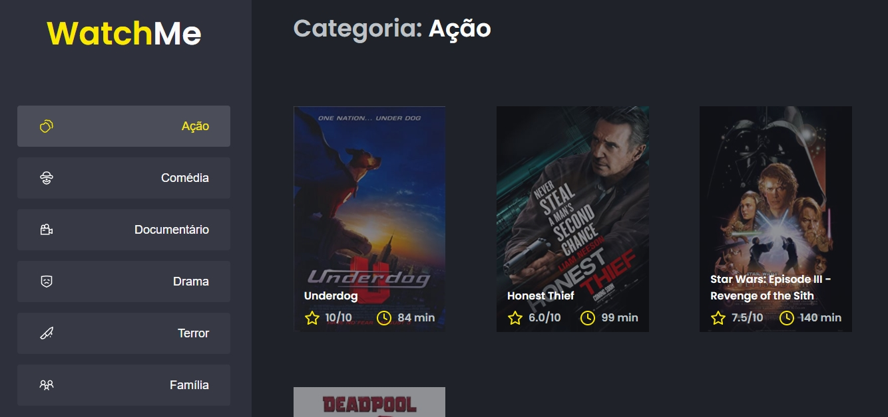
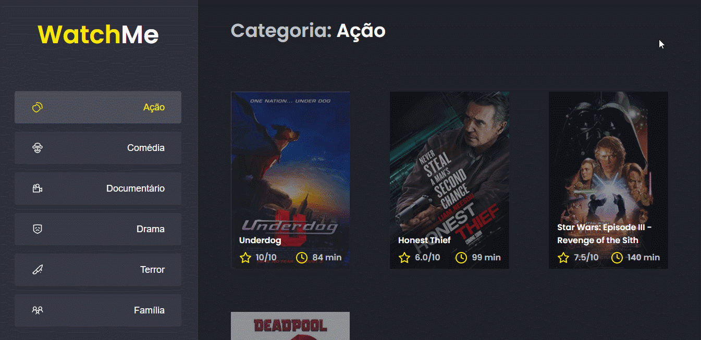

# WatchMe

Esse desafio foi criado para treinar o que aprendeu até agora no ReactJS.

Essa será uma aplicação onde o seu principal objetivo é refatorar uma página para listagem de filmes de acordo com gênero. 

## Tecnologias

- React
- Typescript
- JSON Server

## Demo

